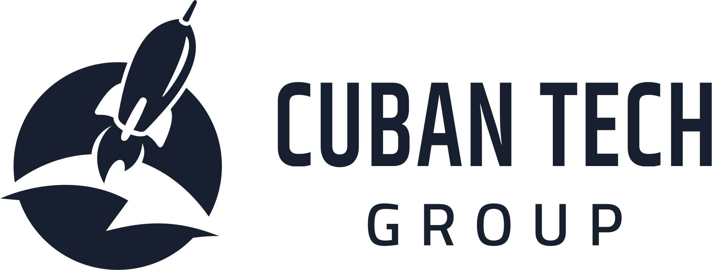

## Conferencia Latinoaméricana de Computación Científica con Python

# SciPyLA 
# ==2017==

# "Más Python, Más ciencia"

### La Habana, Cuba, Mayo 2017

###### [http://scipyla.org/conf/2017/](http://scipyla.org/conf/2017/)

******************************************************************
## ORGANIZADO POR

El grupo CubanTech está integrado por jóvenes cubanos profesionales de la
informática que  colaboran con instituciones, asociaciones y fundaciones 
cubanas para ofrecer actividades de difusión y educación sobre el desarrollo
inclusivo y colaborativo de tecnologías basadas en estándares abiertos. Con
apoyo de la PSF organizaremos el primer PyCon Cuba 2017.

La Python Software Foundation (PSF) es una organización sin ánimos de lucro
y membresía abierta, dedicada al mejoramiento de las tecnologías de
código abierto relacionadas con el lenguaje de programación Python.
La misma opera bajo las reglas del epígrafe 501(c)3 del US Internal Revenue Code,
con el status de organización caritativa, pública, exenta de gravámenes
tributarios, y de carácter científico y educacional.

******************************************************************

## Descripción del taller

SciPyLA 2017 será la ocasión para explorar oportunidades de innovación y conexión con la industria biotecnológica. Cuba destaca dados sus 893 permisos comerciales registrados en más de 50 países. Conozca de primera mano cómo la biotecnología se abre camino en la región.

## Idiomas oficiales

Español, Portugués, Inglés

## Objetivos

*   Promover el uso de enfoques accesibles y reproducibles en la investigación científica.
*   Presentar adelantos científico-técnicos recientes utilizando el lenguaje de programación Python o herramientas hechas en -o relacionadas con- Python.
*   Promover el uso del lenguaje de programación Python en las actividades de investigación científica.
*   Contribuir con el desarrollo tecnológico de América Latina.

******************************************************************

## Tópicos del Taller de Bioinformática ##

*   Sensores biónicos
*   Bio-impresión
*   Bioplásticos
*   Procesamiento para Simulaciones del Cerebro, Corazón y otros órganos
*   Lecturas cerebrales y Neuroinformática
*   Interfaces Cerebro-Máquina
*   Estudios del Cáncer y Tumores utilizando Big Data
*   Polímeros Conductivos
*   Secuenciación de ADN
*   Informática como Servicio para la Salud
*   Inmunoensayos
*   Producción de alimentos in vitro
*   Lab-on-a-chip y Aplicaciones
*   Nanomedicinas y Nanosensores
*   Investigación de virus oncolíticos
*   Tratamientos Personalizados
*   Plagiosis
*   Tratamientos con células madre
*   Lenguajes Abiertos para Biología Sintética.
*   Ingeniería de Tejidos

En general el comité del evento aceptará artículos relacionados con las siguientes disciplinas:

Química Analítica, Astrobiología, Bioquímica, Bioinformática,
Biomateriales, Biomecánica, Biofísica, Biotecnología,
Ingeniería Química, Biología Química, Quimioinformática, Biología Computacional,
Química Computacional, Química Nuclear, Química de Flujos, Genética, Genómica,
Ciencias de la Salud, Inmuno-Química, Inmunología, Biología Matemática,
Química Matemática, Microbiología, Biología Molecular, Mecánica Molecular,
Nanomateriales, Nanotecnologías, Neurociencias, Paleo-Biología,
Ingeniería y Química de Polímeros, Fitoquímica, Biología Estructural,
Química Supramolecular, Biología Sintética, Métodos de Genómica Sintética,
Ingeniería de Tejidos, Virología.
        
******************************************************************

### Aplicar [aquí](../forms/reviewers/es) para ser referee académico del evento.

###### [http://scipyla.org/conf/2017/forms/reviewers/es](../forms/reviewers/es)

N.B. Las aplicaciones para ayudar financieramente a los revisores son
independientes a las [ayudas financieras](http://scipyla2017.cuban.tech/forms/financial-aid/es)
ofrecidas a los asistentes y se gestionarán y otorgarán siguiendo criterios
específicos para cada caso.

******************************************************************

### Indicaciones para los Autores

SciPyLA 2017 tendrá varias publicaciones seriadas, una publicación arbitrada de artículos completos, y una monografía con resúmenes de otros trabajos. Ambos volúmenes del evento serán gestionados a través del sistema online para el envío, revisión y publicación final de los papers.

La conferencia ofrece a los investigadores y candidatos a doctor de la región la oportunidad de publicar en la revista internacional **The Python Papers** (TPP), ISSN: 1834-3147, la cual está indexada en

|         |             |
|:-------:|-------------|
|  | **Google Scholar** : Buscador de Google para artículos académicos |
|  | **Directory of Research Journals Indexing** : *3674* revistas indexadas, *96378* artículos en total, *190* países |
|  | **Index Copernicus** : La base de datos del [Índice Maestro de Revistas ICI](http://journals.indexcopernicus.com/page.php?page=2) contiene más de *22,000* revistas. El ICV es un indicador de la relevancia de una publicación seriada. El mismo ofrece información sobre cuan rápidamente se incrementa la tasa de citas de un artículo publicado.ICV es un indicador para publicaciones seriadas de temas científicos, respetado y establecido.|
|  | **Directory of Open Access Journals** : *9,457* revistas indexadas, *128* países, *2,442,144* artículos. |
|  | **OAIster (R)** : OAIster incluye más de 50 millones de fichas bibliográficas que representan recursos provenientes de más de *2,000* fuentes.|
|  | **OCLC FirstSearch (R)** : El servicio OCLC FirstSearch (R)  es un punto de acceso a bases de datos investigativas.|
|  | **Pandora, Australia's web archive** : PANDORA (Preserving and Accessing Networked Documentary Resources of Australia), es una collección cada vez más grande de publicaciones digitales australianas en línea |
|  | **National Library of Australia** : |
|  | **Ovid LinkSolver** : Una herramienta de búsqueda y enlace de publicaciones seriadas y libros .|
|  | **Ulrich's Global Serial Directory** : |
|  | **EBSCOhost Research Databases** : Las bases de datos EBSCOhost incluyen los recursos PREMIUM en línea más frecuentemente utilizados por decenas de miles de instituciones que representan millones de usuarios en todo el mundo. Ahora es posible acceder a cinco nuevas bases de datos PREMIUM en las que EBSCO ofrece contenidos de calidad suprema, puestos a disposición mediante servicios de búsqueda capaces de brinda resultados relevantes y cobertura global. |
|  | **OCLC Worldcat** : |
|  | **Electronic Journal Library @ University Library of Regensburg** : Electronic Journals Library es un servicio que facilita el acceso a publicaciones seriadas distribuidas por internet. En este momento *616* instituciones colaboran activamente en el proyecto. |
|  | **eGranary Digital Library** : eGranary Digital Library - también conocida como *la Internet dentro de una caja* - ofrece millones de recursos educacionales a instituciones que carecen de acceso a internet adecuado |

******************************************************************

Los trabajos considerados relevantes por los revisores académicos podrán publicarse en otras revistas de los socios académicos del evento previa comunicación con usted.

### Instrucciones para publicar en The Python Papers (TPP)

1. [Registrarse como autor en TPP](http://ojs.pythonpapers.org/index.php/tpp/user/register).
2. [Enviar un artículo](http://ojs.pythonpapers.org/index.php/tpp/author/submit).
    
    2.1. Seleccione la opción "Peer-reviewed Articles", y siga las instrucciones.
    
    2.2. **Importante:** agregar **SciPyLA2017** en el campo "Comments for the Editor".

3. Arbitros expertos en su temática harán la revisión.
4. Se le notificará la decisión editorial: [(ver fechas)](#deadlines).
    
    4.1 RECHAZADO: Ud. solo podrá leer los commentarios hechos por los expertos.
    
    4.2 ACEPTADO: Ud. deberá enviar antes de la fecha indicada cualquier corrección que le sea solicitada. [(ver fechas)](#deadlines).

Para más información le invitamos a consular las [instrucciones de publicación en The Python Papers](http://www.pythonpapers.org/instAuthor.html)

#### Instrucciones para envío de resúmenes en la Monografía TPPM

Si Ud. desea presentar un poster, solamente debe enviar un resumen. Cambie el paso 1 y regístrese en: [autor en TPPM](http://ojs.pythonpapers.org/index.php/tppm/user/register)

#### Formato para redacción de los artículos.

Por favor, antes de seguir los pasos para enviar su artículo, asegúrese de haber utilizado una de las siguientes plantillas para redactar su contenido.

* [Plantilla ODT para redactar su artículo](http://ojs.pythonpapers.org/templates/TPP_TPPSC_template.odt)
* [Plantilla DOC para redactar su artículo](http://ojs.pythonpapers.org/templates/TPP_TPPSC_template.doc)

#### Fechas Importantes {#deadlines}

*   Sitio Web de la Conferencia: Agosto 2016
*   Aceptación de revisores: 15 abril 2016
*   Recepción de trabajos: 1 de mayo 2017
*   Respuesta de revisores: 1 de junio 2017
*   Envío de correcciones: 15 de julio 2017

******************************************************************

## Actividades previstas {#activities}

* **Tutoriales** : Talleres ofrecidos por expertos dirigidos a mejorar la productividad de los investigadores.

* **Presentaciones y charlas:** Conferencistas invitados hablarán acerca de tendencias mundiales y mejores prácticas en el ámbito científico.

*   **Sesiones de Posters:** Exponga sus investigaciones utilizando pancartas y medios visuales atractivos.

*   **Sprints:** Reúnase con los autores de bibliotecas singulares para conocer maneras más eficientes de realizar cálculos científicos.

*   **Charlas relámpago:** Promocione y amplíe el alcance de su investigación exponiendo en breve tiempo sus ideas a los especialistas de la región.

# Inscripción / Asistencia / Pagos

Las [cuotas de inscripción](../register) cubren solamente la posibilidad de asistir al evento y están diferenciadas por regiones para promover la participación de estudiantes, profesionales e investigadores de América Latina y el Caribe imposibilitados de estar presencialmente en el evento por circunstancias de índole económica u otras razones. Para más detalles sobre el tema consulte las [cuotas de inscripción](../register). Para conocer otras maneras de financiar su participación infórmese sobre [las ayudas financieras](../forms/financial-aid/es).

TODO: Travel guidelines

******************************************************************

# Contactos {#Contact}

Ayúdenos a organizar sus intereses en la agenda de la conferencia enviando su área específica de investigación a los contactos del evento. 

*   2017@scipyla.org
*   scipyla2017@pythoncuba.org
*   scipyla2017@cuban.tech

Si estuviera interesado en otros temas le invitamos a conocer la [lista de talleres del evento](../tracks).

