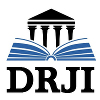
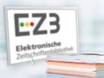

## 5ta Conferencia Latinoamericana de Computación Científica con Python

# SciPyLA 
# ==2017==

## Más Python, Más ciencia

##### Varadero, Cuba, Septiembre / Octubre 2017

###### [http://scipyla.org/conf/2017/](http://scipyla.org/conf/2017/)

******************************************************************
## ORGANIZADO POR

El grupo CubanTech está integrado por jóvenes cubanos profesionales de la
informática que  colaboran con instituciones, asociaciones y fundaciones 
cubanas para ofrecer actividades de difusión y educación sobre el desarrollo
inclusivo y colaborativo de tecnologías basadas en estándares abiertos. Con
apoyo de la PSF organizaremos el primer PyCon Cuba.

La Python Software Foundation (PSF) es una organización sin ánimos de lucro
y membresía abierta, dedicada al mejoramiento de las tecnologías de
código abierto relacionadas con el lenguaje de programación Python.
La misma opera bajo las reglas del epígrafe 501(c)3 del US Internal Revenue Code,
con el status de organización caritativa, pública, exenta de gravámenes
tributarios, y de carácter científico y educacional.

******************************************************************

## Taller Latinoamericano de Python, Automática y Control de Procesos

Investigadores y emprendedores se reunirán en La Habana para debatir acerca del potencial de la robótica, la inteligencia artificial y la ingeniería eléctrica para implementar aplicaciones disruptivas, explicando cómo Python permitió obtener una ventaja competitiva.

## Idiomas oficiales

Español, Portugués, Inglés

## Objetivos

*   Promover el uso de enfoques accesibles y reproducibles en la investigación científica.
*   Presentar adelantos científico-técnicos recientes utilizando Python o herramientas relacionadas.
*   Promover el uso de Python en el desarrollo de la ciencia.
*   Contribuir con el desarrollo tecnológico de América Latina.

******************************************************************

## Tópicos del Taller de Automática y Control de Procesos ##

Algunas áreas específicas de interés son:

* Impresión 3D
* Soluciones para displays 3D y monitores holográficos
* Procesamiento adaptivo de señales
* Robots para la agricultura
* Robots humanoides
* Vehículos autónomos
* Biónica
* Algoritmos y programación para claytronics
* Soluciones robóticas en la nube
* Sistemas con adaptabilidad colectiva
* Manufactura basada en computadora
* Dispositivos holográficos generados por computadora
* Sensores digitales de medición de fragancias
* Vehículos eléctricos
* Sistemas de redes de alta eficiencia energética
* Tecnologías de smart-grid
* Sistemas expertos para la industria
* Vehículos voladores
* Redes de sensores de nueva generación
* Prototipado y simulación de hardware
* Interfaces robot-operador
* Inteligencia artificial para detección de fallas
* Aprendizaje automatizado (machine Learning) en aplicaciones de control
* MyHDL
* Redes de Petri (diseño y verificación de sistems, protocolos y redes)
* Exoesqueletos
* Sistemas en tiempo real
* Diseño, desarrollo y control de robots
* Cirugía asistida por robots
* Robots modulares auto-configurables
* Auto-organización, auto-estabilizaación y computación autónoma
* Diseño simulación de soluciones System-on-Chip
* Sistemas inteligentes de control basados en agentes
* Sistemas de comunicación para vehículos
* Prototipado virtual y prueba de sistema ciber-físicos
* Dispositivos wearable

In general the program committee will accept paper submissions related to the following disciplines:

Aerospace Engineering, Artificial Intelligence, Control Systems and Theory, Electronics,
Electronic Design Automation, Electronic materials and Devices, Hardware Design,
High-Performance Computing, Magnetic Materials and Devices, Mechatronics,
Optical materials and devices, Robotics, Semiconductors.

En general el comité del evento aceptará artículos relacionados con las siguientes disciplinas:

Ingeniería aeroespacial, inteligencia artificial, sistemas de control, electrónica,
automatización de procesos de diseño de hardware, materiales y dispositivos electrónicos,
diseño de hardware, computación de gama alta, materiales y dispositivos magnéticos,
mecatrónica, materiales y dispositivos ópticos, robótica, tecnologías para semiconductores.

******************************************************************

### Aplicar [aquí](../forms/reviewers/es) para ser referee académico del evento.

###### [http://scipyla.org/conf/2017/forms/reviewers/es](../forms/reviewers/es)

Nota: Las aplicaciones para ayudar financieramente a los revisores son independientes a las [ayudas financieras](../forms/financial-aid/es) ofrecidas a los asistentes y se gestionarán y otorgarán siguiendo criterios específicos para cada caso.

******************************************************************

### Indicaciones para los Autores

SciPyLA 2017 tendrá dos publicaciones seriadas, la primera contendrá artículos completos arbitrados, la segunda publicará una monografía con los resúmenes de los posters. Ambos volúmenes del evento serán gestionados a través del [sistema online](http://ojs.pythonpapers.org/) para el envío, revisión y publicación final de los papers.

La conferencia ofrece a los investigadores de la región la oportunidad de publicar en la revista internacional **The Python Papers** (TPP), ISSN: 1834-3147, para los artículos completos, y en "The Python Papers Monograph" los resúmenes de los posters. Ambas revistas están indexadas en:

|                                          |                                          |
| :--------------------------------------: | ---------------------------------------- |
|  | **Google Scholar** : Buscador de Google para artículos académicos |
|      | **Directory of Research Journals Indexing** : *3674* revistas indexadas, *96378* artículos en total, *190* países |
|  | **Index Copernicus** : La base de datos del [Índice Maestro de Revistas ICI](http://journals.indexcopernicus.com/page.php?page=2) contiene más de *22,000* revistas. El ICV es un indicador de la relevancia de una publicación seriada. El mismo ofrece información sobre cuan rápidamente se incrementa la tasa de citas de un artículo publicado.ICV es un indicador para publicaciones seriadas de temas científicos, respetado y establecido. |
|      | **Directory of Open Access Journals** : *9,457* revistas indexadas, *128* países, *2,442,144* artículos. |
|  | **OAIster (R)** : OAIster incluye más de 50 millones de fichas bibliográficas que representan recursos provenientes de más de *2,000* fuentes. |
|  | **OCLC FirstSearch (R)** : El servicio OCLC FirstSearch (R)  es un punto de acceso a bases de datos investigativas. |
|  | **Pandora, Australia's web archive** : PANDORA (Preserving and Accessing Networked Documentary Resources of Australia), es una collección cada vez más grande de publicaciones digitales australianas en línea |
|  | **National Library of Australia** :      |
|  | **Ovid LinkSolver** : Una herramienta de búsqueda y enlace de publicaciones seriadas y libros . |
|  | **Ulrich's Global Serial Directory** :   |
|  | **EBSCOhost Research Databases** : Las bases de datos EBSCOhost incluyen los recursos PREMIUM en línea más frecuentemente utilizados por decenas de miles de instituciones que representan millones de usuarios en todo el mundo. Ahora es posible acceder a cinco nuevas bases de datos PREMIUM en las que EBSCO ofrece contenidos de calidad suprema, puestos a disposición mediante servicios de búsqueda capaces de brinda resultados relevantes y cobertura global. |
|  | **OCLC Worldcat** :                      |
|  | **Electronic Journal Library @ University Library of Regensburg** : Electronic Journals Library es un servicio que facilita el acceso a publicaciones seriadas distribuidas por internet. En este momento *616* instituciones colaboran activamente en el proyecto. |
|  | **eGranary Digital Library** : eGranary Digital Library - también conocida como *la Internet dentro de una caja* - ofrece millones de recursos educacionales a instituciones que carecen de acceso a internet adecuado |

******************************************************************

Los trabajos considerados relevantes por los revisores académicos podrán publicarse en otras revistas de los socios académicos del evento previa comunicación con usted.

### Instrucciones para publicar en The Python Papers (TPP)

1. [Registrarse como autor en TPP](http://ojs.pythonpapers.org/index.php/tpp/user/register).

   Seleccionar el registro "as author".

2. [Enviar un artículo antes del 1 de Mayo](http://ojs.pythonpapers.org/index.php/tpp/author/submit).

    2.1. Seleccione la opción "Peer-reviewed Articles", y siga las instrucciones.

    2.2. **Importante:** agregar **SciPyLA2017** en el campo "Comments for the Editor".

3. Arbitros expertos en su temática harán la revisión.

4. Se le notificará la decisión editorial antes del 1ro de Junio:  (ver sección __Fechas Importantes__)).

    4.1 RECHAZADO: Ud. solo podrá leer los commentarios hechos por los expertos.

    4.2 ACEPTADO: Ud. deberá enviar antes de la fecha indicada cualquier corrección que le sea solicitada.  (ver sección __Fechas Importantes__).

#### Instrucciones para envío de Posters a la Monografía TPPM

Usted solamente necesitará enviar un resúmen de la presentación de su poster.

1. [Registrarse](http://ojs.pythonpapers.org/index.php/tppm/user/register).

   Seleccionar el registro "as author".

2. [Enviar el resumen antes del 1 de Mayo](http://ojs.pythonpapers.org/index.php/tppm/author/submit).

    2.1. Seleccione la opción "Peer-reviewed Articles", y siga las instrucciones.

    2.2. **Importante:** agregar **ScipyLA2017** en el campo "Comments for the Editor".

3. Arbitros expertos en su temática harán la revisión.

4. Se le notificará la decisión editorial antes del 1ro de Junio: (ver sección __Fechas Importantes__).

    4.1 RECHAZADO: Ud. podrá leer los commentarios hechos por los expertos.

    4.2 ACEPTADO: Ud. deberá enviar antes de la fecha indicada la versión final corregida del resumen antes del 15 de Julio (ver sección __Fechas Importantes__).

5. Envíe el poster completo a los __Contactos del Evento__ antes del 15 de Julio (ver sección __Fechas Importantes__).

#### Formato para redacción de los artículos.

Por favor, antes de seguir los pasos para enviar su artículo, asegúrese de haber utilizado una de las siguientes plantillas para redactar su contenido.

* [Plantilla ODT para redactar su artículo](http://ojs.pythonpapers.org/templates/TPP_TPPSC_template.odt)
* [Plantilla DOC para redactar su artículo](http://ojs.pythonpapers.org/templates/TPP_TPPSC_template.doc)
* [Plantillas para Posters](https://github.com/scipy-latinamerica/scipyla2017/tree/master/print_materials/posters)

Los artículos completos no excederán las 10 páginas.

Los posters tendrán una dimensión de 70cmx100cm, con márgenes por sus cuatro lados de 2cm. Use las mismas fuentes ofrecidas en las plantillas, adicionando de manera obligatoria título, autores, contactos, resumen y resultados, y luego otros de su elección.

Para más información le invitamos a consular las [instrucciones de publicación en The Python Papers](http://www.pythonpapers.org/instAuthor.html)

#### Fechas Importantes {#deadlines}

*   Sitio Web de la Conferencia: Agosto 2016
*   Aceptación de revisores: 25 abril 2017
*   Recepción de trabajos: 1 de mayo 2017
*   Respuesta de revisores: 1 de junio 2017
*   Envío de correcciones: 15 de julio 2017

******************************************************************

## Actividades previstas {#activities}

* **Tutoriales** : Talleres ofrecidos por expertos dirigidos a mejorar la productividad de los investigadores.

* **Presentaciones y charlas:** Conferencistas invitados hablarán acerca de tendencias mundiales y mejores prácticas en el ámbito científico.

* **Sesiones de Posters:** Exponga sus investigaciones utilizando pancartas y medios visuales atractivos.

* **Sprints:** Reúnase con los autores de bibliotecas singulares para conocer maneras más eficientes de realizar cálculos científicos.

* **Charlas relámpago:** Promocione y amplíe el alcance de su investigación exponiendo en breve tiempo sus ideas a los especialistas de la región.

# Inscripción / Asistencia / Pagos

Las [cuotas de inscripción](../register) cubren solamente la posibilidad de asistir al evento y están diferenciadas por regiones para promover la participación de estudiantes, profesionales e investigadores de América Latina y el Caribe imposibilitados de estar presencialmente en el evento por circunstancias de índole económica u otras razones. Para más detalles sobre el tema consulte las [cuotas de inscripción](../register). Para conocer otras maneras de financiar su participación infórmese sobre [las ayudas financieras](../forms/financial-aid/es).

Para facilitar su viaje a Cuba le recomendamos leer [Instrucciones para viajar a Cuba](http://scipyla.org/conf/2017/travel).

******************************************************************

# Contactos {#Contact}

Haga suya nuestra agenda enviando sus intereses y área específica de investigación a los **contactos del evento**. 

*   2017@scipyla.org
*   scipyla2017@pythoncuba.org
*   scipyla2017@cuban.tech

Puede revisar la [lista de talleres del evento](../tracks). construida colaborativamente.

